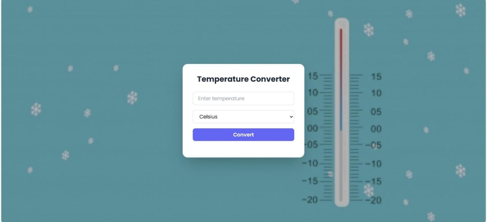

# SCT_SD_1

This is the initial setup for the **Temperature Converter** project. This web app converts temperatures between **Celsius**, **Fahrenheit**, and **Kelvin**. It features smooth animations using **GSAP** and styling with **Tailwind CSS**.

---

## 🌐 Live Demo

You can see the live version here:  
[Temperature Converter Live](https://sakshiprashar.github.io/SCT_SD_01/)

---

## 📁 Project Structure

SCT_SD_01/
├── index.html # Main HTML file
├── style.css # CSS for styling (background + custom styles)
├── script.js # JavaScript functionality with GSAP animations
└── image/ # Folder for background or other images

---

## 🚀 Features

- Responsive HTML layout with Tailwind CSS  
- Smooth animations using **GSAP**  
- Convert temperatures between Celsius, Fahrenheit, and Kelvin  
- Input validation and error messages  
- Press **Enter** to convert as well as clicking the button  
- Clean, organized folder structure  

---

## 💻 Technologies Used

- **HTML5** – structure of the app  
- **CSS3 + Tailwind** – styling and layout  
- **JavaScript (ES6)** – logic for temperature conversion  
- **GSAP** – animations for converter box and results  

---

## 📷 Screenshots

  

---

## 🛠️ How to Run Locally

1. Clone the repository:
git clone https://github.com/SakshiPrashar/SCT_SD_1.git

2. Navigate into the folder: cd SCT_SD_1

3. Open index.html in your preferred browser.

Enter a temperature, select the input unit, choose the output unit, and click Convert (or press Enter) to see the result.

✍️ Author
Sakshi
